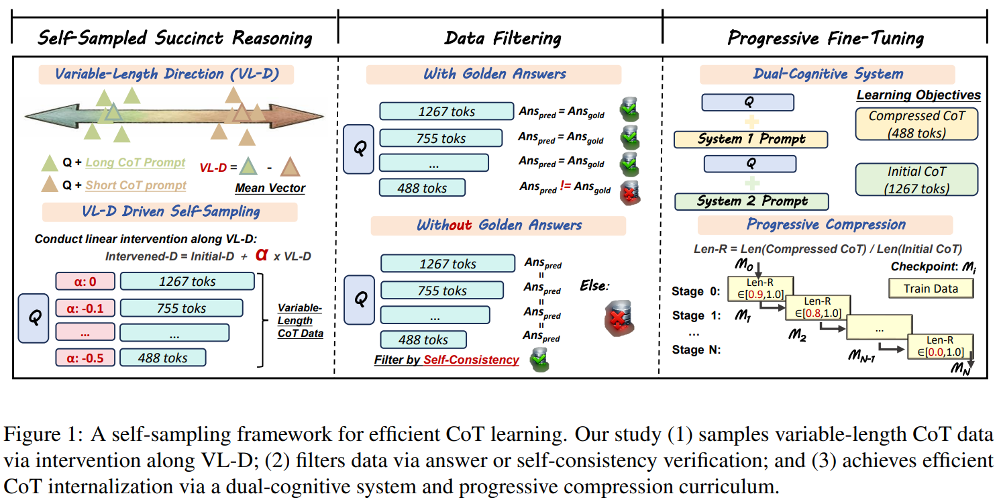

# S³-CoT & Meta-Cognitive

Official repository for two complementary lines of research:

1. S³-CoT: Self-Sampled Succinct Reasoning Enables Efficient Chain-of-Thought LLMs
2. From Latent Signals to Reflection Behavior: Tracing Meta-Cognitive Activation Trajectory in R1-Style LLMs. 

---

## 🔥 News

* **(TBD)**: We have open-sourced **model checkpoints** (https://huggingface.co/yrdu) first, and then open-source the **self-sampled data**  and **related code** after the paper is accepted.
* **2026-02**: Released preprints (**S³-CoT** and **Meta-Cognitive**) on Arxiv. 

---

## ✨ Summary

* **S³-CoT** focuses on *data sampling*: we use **activation steering** along an identified **variable-length direction (VL-D)** to **self-sample reasoning traces of variable lengths** from the target LLM itself, then filter them with answer/self-consistency verification and progressively fine-tune for succinct reasoning.   

* **Meta-Cognitive Analysis** focuses on *mechanistic explanation*: it explains **why activation steering can reliably control reasoning length**, by revealing a depth-wise causal chain—**latent-control layers** encode thinking-budget signals, which propagate to **semantic-pivot layers** (turning-point vs summarization cue competition) and finally to **behavior-overt layers**, ultimately changing the sampling likelihood of reflection markers and the overall thinking length.   


---

## 📌 Project 1 — S³-CoT: Self-Sampled Succinct Reasoning Enables Efficient CoT LLMs

**Goal.** Enable LLMs to acquire a *fast-thinking* mode by learning **varaible-length CoT traces** while maintaining accuracy. 

**Key idea.** Instead of relying on external teacher models, S³-CoT proposes a **self-sampling framework** based on **activation steering**:

* Identify a **Variable-Length Direction (VL-D)** that controls CoT verbosity. 
* Sample **style-aligned, variable-length** CoTs from the *target model itself* by intervening along VL-D. 
* Filter data via **gold-answer verification** or **self-consistency verification** (prediction-consistent variants). 
* Fine-tune with a **dual-cognitive system** and a **progressive compression curriculum** to avoid over-compression collapse. 

**Highlights.**

* Teacher-free data acquisition (self-sampled CoTs), alleviating the SFT supervision bottleneck. 
* Works well across **general LLMs** and **R1-style LLMs**, while maintaining accuracy on math benchmarks & medical generalization tests. 

---

## 📌 Project 2 — From Latent Signals to Reflection Behavior: Tracing Meta-Cognitive Activation Trajectory in R1-Style LLMs

**Goal.** Explain *how reflection emerges internally* in R1-style LLMs by anchoring on reflection markers (e.g., “Wait”) and tracing signals across layers. 

**Findings (stage-wise progression).** Using logit-lens decoding to read out token-level semantics, we observe a structured depth-wise process:

1. **Latent-control layers**: an approximately linear direction encodes **thinking-budget semantics** (e.g., detailed vs concise). 
2. **Semantic-pivot layers**: probability mass shifts to discourse cues such as **turning-point tokens** (but/however) and **summarization tokens** (so/therefore). 
3. **Behavior-overt layers**: **reflection-behavior tokens** (e.g., “Wait”) rise until they are highly likely to be sampled. 

**Causal verification.** Targeted interventions support a depth-wise causal chain:

* Prompt-level semantics modulate projections along latent-control directions → induce competition between turning-point vs summarization cues in semantic-pivot layers → regulate sampling likelihood of reflection markers in behavior-overt layers. 

---

## 🧩 Open-Source Releases (Models & Data)

> We will update this section once artifacts are uploaded.

### S³-CoT

* **Model Checkpoints:**
  
| Base Model | Our Trained Model | Link |
|------------|---------------|------|
| DeepSeek-R1-Distill-Qwen-7B | S3-CoT-DeepSeek-R1-Distill-Qwen-7B | https://huggingface.co/yrdu/S3-CoT-DeepSeek-R1-Distill-Qwen-7B |
| Qwen2.5-7B-Instruct | S3-CoT-Qwen2.5-7B-Instruct | https://huggingface.co/yrdu/S3-CoT-Qwen2.5-7B-Instruct |
| Llama-3.1-8B-Instruct | S3-CoT-Llama-3.1-8B-Instruct | https://huggingface.co/yrdu/S3-CoT-Llama-3.1-8B-Instruct |
| Qwen3-4B-Thinking-2507| S3-CoT-Qwen3-4B-Thinking-2507 | https://huggingface.co/yrdu/S3-CoT-Qwen3-4B-Thinking-2507 |

* **Inference Template:**
we provide System 1 and System 2 templates used in our training. During inference, please use the **System 1 template** to reproduce the results reported in our paper.

```python
from transformers import AutoModelForCausalLM, AutoTokenizer

system1_template = " Please provide as a brief reasoning process as possible, and put your final answer within \\boxed{}"
system2_template = " Please reason step by step, and put your final answer within \\boxed{}"

tokenizer = AutoTokenizer.from_pretrained(model_name)
model = AutoModelForCausalLM.from_pretrained(
    model_name,
    device_map="auto",
    torch_dtype="bfloat16",
)
generation_config={"xxx"}
prompt = "xxx"

messages = [
    {"role": "user", "content": prompt+system1_template}
]
text = tokenizer.apply_chat_template(
    messages,
    tokenize=False,
    add_generation_prompt=True
)

model_inputs = tokenizer([text], return_tensors="pt").to(model.device)
generated_ids = model.generate(
    **model_inputs,
    **generation_config,
)

output_ids = generated_ids[0][len(model_inputs.input_ids[0]):].tolist()
output_content = tokenizer.decode(output_ids, skip_special_tokens=True)
```

* **Data:** `[HuggingFace]`
* **Code:** The training script will be open-sourced after the paper is accepted.

### Meta-Cognitive

* **Code:** The related analysis code will be open-sourced after the paper is accepted.

---

## 📬 Contact

* **Yanrui Du** — `yrdu@ir.hit.edu.cn` 

---

